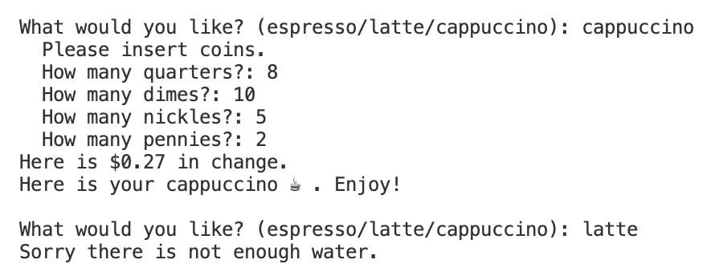

# Tall! Decaf! Cappuccino! (OOP Edition)

With this OOP coffee machine, you can order a coffee just how you like it. ☕️

Choose an espresso, latte, or cappuccino; pay for it; and get your change. Order as many drinks as you would like until the machine runs out of ingredients.

## Demo

## Sources
This project is based on Day 15 of Angela Yu's [100 Days of Code - The Complete Python Pro Bootcamp](https://www.udemy.com/course/100-days-of-code/).